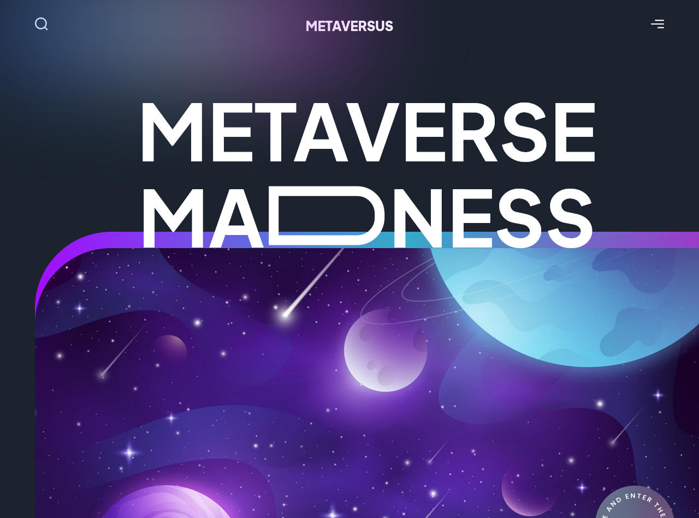
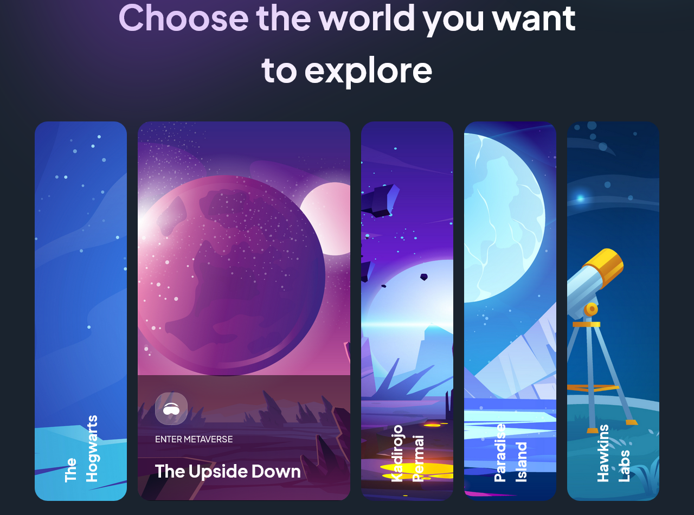
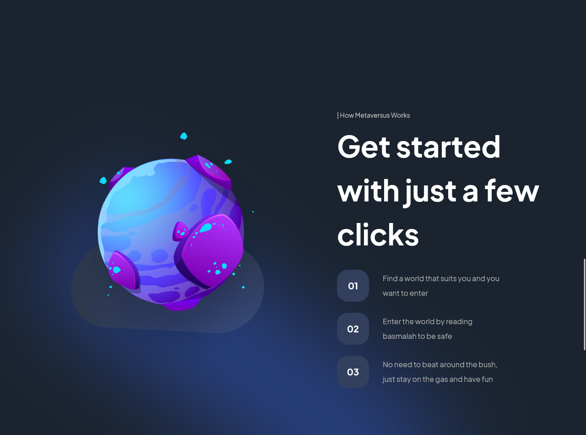
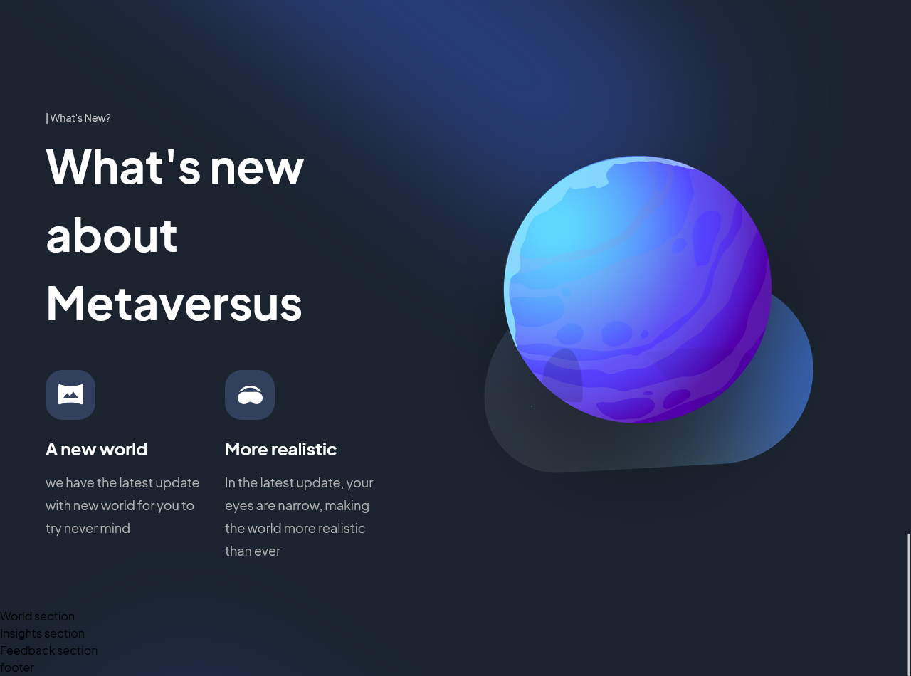

# Unveiling the Metaverse: A Cutting-Edge Web Experience

Hi Future Developer!

Welcome to my latest project! This time, I've crafted a web page that exudes modernity and sophistication, boasting a range of captivating features. Within its virtual walls, you'll encounter a treasure trove of content centered around the technological marvel known as the Metaverse. Brace yourself for an immersive journey complemented by captivating motion animations that promise to delight the senses.

Choose your realm and embark on a riveting exploration! With just a single click, you'll be transported to the world of your choice. And that's not all – armed with a VR device, you'll find yourself enveloped in an experience that's nothing short of extraordinary. Boundless exploration awaits, so dive in without hesitation!

Ready to dive into the limitless world of the Metaverse? Let's get started!

*\* While the application is still in its developmental stage and may have some limitations, I'm eager to provide users with a valuable experience that can evolve and improve over time. Your input and experience will help shape the future of this exciting project.* 

*Thank you for your interest. Happy coding!*

## Powering Up with Tech Stack! ⚡

This project is fueled by an electrifying lineup of technologies:
- [NextJs](https://nextjs.org/) - Unleash the power of modern web development.
- [TailwindCss](https://tailwindcss.com/) - Craft stylish and responsive interfaces effortlessly.
- [Framer Motion](https://www.framer.com/motion/) - Elevate user experience with captivating animations

Prepare for an exhilarating ride through innovation and efficiency with this impressive tech stack!

## Licensing Groove🕺

Exciting news! This project is grooving to the rhythm of the [MIT License](https://github.com/novaardiansyah/metaverse-modern-webapp/blob/main/LICENSE)! 🎉

## Let's Connect! 📞

Need to chat? Feel free to drop me a line via [Email](mailto:novaardiansyah78@gmail.com) or hit me up on  [Whatsapp](https://wa.me/6289506668480?text=Hi%20Nova,%20I%20have%20a%20question%20about%20Modern%20Metaverse%20Web%20Application) I'm just a message away, ready to groove with you! 📩

## Sneak Peek 🌟

Get a glimpse of the app's enchanting world by exploring the current progress at [https://metaverse.novaardiansyah.site/](https://metaverse.novaardiansyah.site/). Feast your eyes on these snapshots that showcase the app's dynamic essence:

  
  

  
  

## Project Status 🚀 

